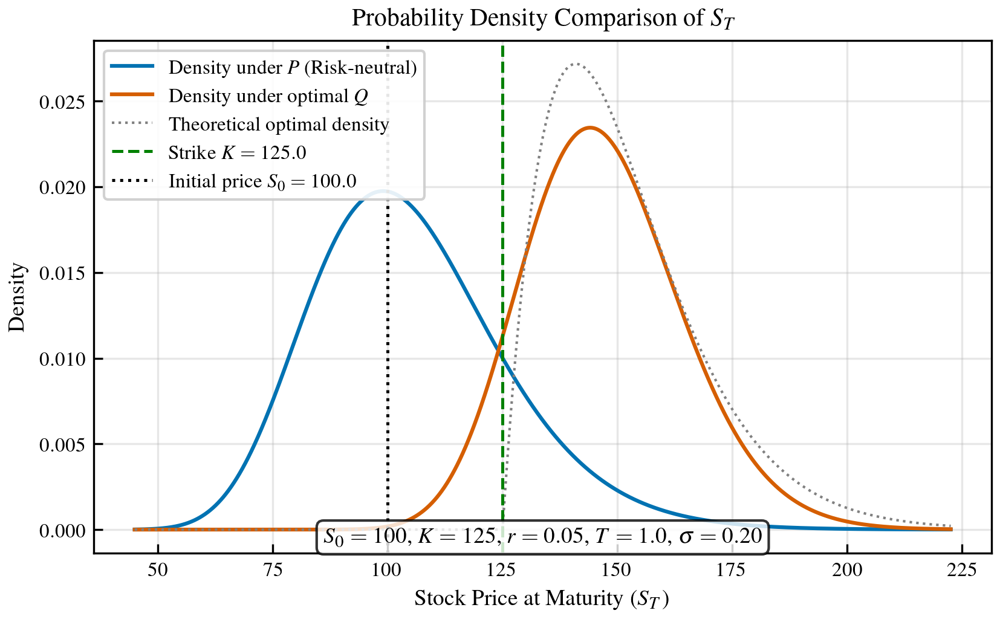
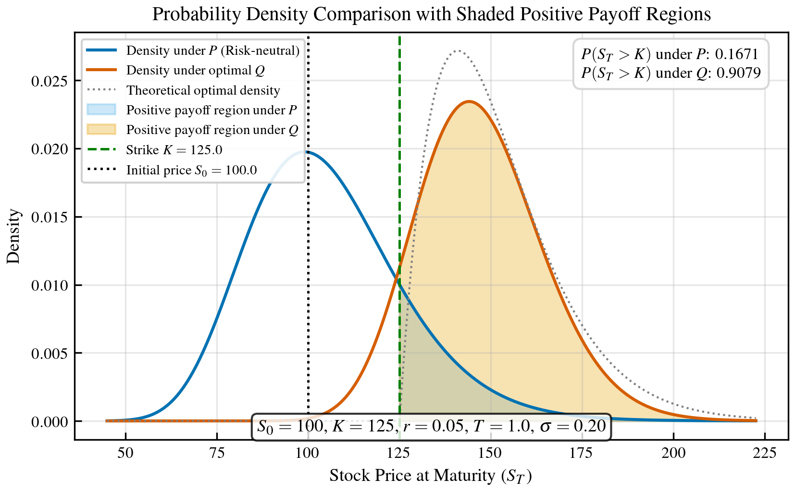
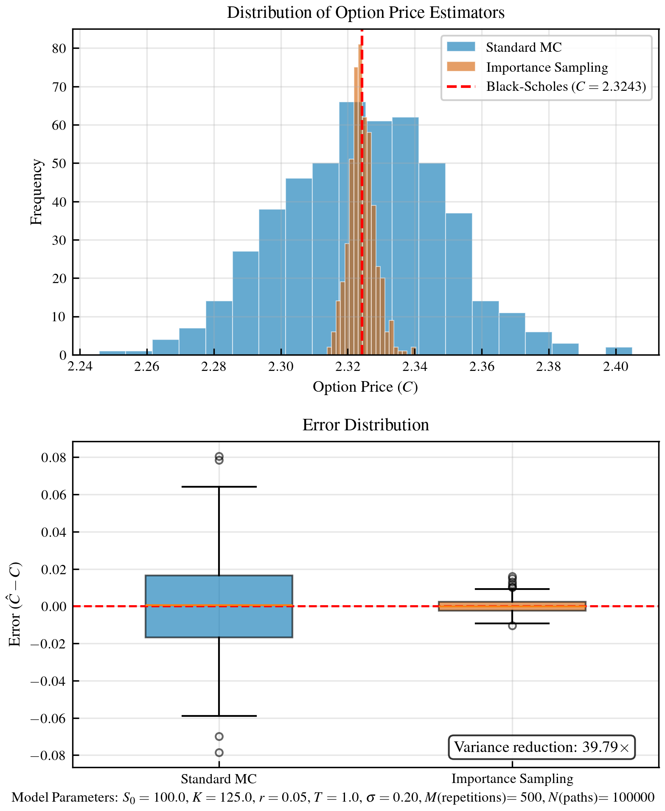
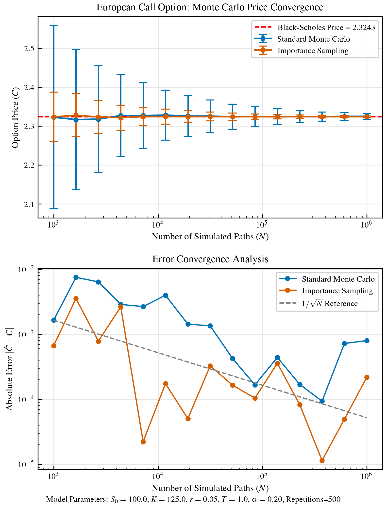

# Importance Sampling for European Call Option Pricing

This repository contains an implementation of an importance sampling (IS) technique for pricing options under the Geometric Brownian Motion (GBM) framework. The method extends the Glasserman-Heidelberger-Shahabuddin (hereafter GHS) approach by optimizing both drift and volatility parameters, resulting in significant variance reduction and improved computational efficiency for rare event simulations in option pricing.

## Usage

Clone the repository and run the program as follows:

```sh
$ python -m venv venv
$ source venv/bin/activate
$ pip install -r requirements.txt
$ python main.py
```

## Background

### Importance Sampling in Monte Carlo Simulation

Monte Carlo methods are widely used in financial engineering to compute option prices. However, when the event of interest (e.g., an option expiring in the money) is rare, standard simulation techniques may suffer from high variance. Importance sampling reduces this variance by drawing samples from an alternative density that places greater weight on regions with significant contributions to the payoff. Specifically, if the objective is to compute

$$
\alpha = \mathbb{E}[h(X)] = \int h(x) f(x) \, dx,
$$

one may instead sample from a density $g$ (with $f(x) > 0 \implies g(x) > 0$) and write

$$
\alpha = \int h(x) \frac{f(x)}{g(x)} g(x) \, dx = \tilde{\mathbb{E}}\left[h(X)\frac{f(X)}{g(X)}\right],
$$

where the likelihood ratio $f(x)/g(x)$ corrects for the change of measure.


## Implementation Details

### The GBM Model

Under the real-world measure $P$, the stock price process follows a Geometric Brownian Motion:

$$
dS_t = \mu S_t dt + \sigma S_t dW_t, \quad S_0 > 0
$$

where $W_t$ is a standard Brownian motion under $P$, $\mu$ is the drift, and $\sigma$ is the volatility.

The closed-form solution is:

$$
S_T = S_0 \exp\left\{ \left(\mu - \frac{1}{2}\sigma^2\right)T + \sigma W_T\right\}
$$

### Logarithmic Transformation

Defining $X = \ln S_T$, we have:

$$X = \ln S_0 + \left(\mu - \frac{1}{2}\sigma^2\right)T + \sigma W_T$$

Under measure $P$, $X \sim \mathcal{N}(m, v)$ where:
- $m = \ln S_0 + \left(\mu - \frac{1}{2}\sigma^2\right)T$
- $v = \sigma^2 T$

### Importance Sampling Measure

We introduce an alternative measure $Q$ under which:

$$dS_t = \tilde{\mu} S_t dt + \tilde{\sigma} S_t d\widetilde{W}_t$$

where $\tilde{W}_t$ is a Brownian motion under $Q$.

Under measure $Q$, $X \sim \mathcal{N}(\tilde{m}, \tilde{v})$ where:
- $\tilde{m} = \ln S_0 + \left(\tilde{\mu} - \frac{1}{2}\tilde{\sigma}^2\right)T$
- $\tilde{v} = \tilde{\sigma}^2 T$

### Likelihood Ratio

When we change measure from P to Q, the importance sampling estimator must be weighted by the likelihood ratio $L(x) = \frac{dP}{dQ}(x)$.

The probability density function (pdf) of a normal distribution $N(\mu_0,\nu)$ is given by

$$
f(x) = \frac{1}{\sqrt{2\pi\,\nu}}\exp\!\Bigl\{-\frac{(x-\mu_0)^2}{2\nu}\Bigr\}.
$$

Under P:

$$
f_P(x) = \frac{1}{\sqrt{2\pi\,v}}\exp\!\Bigl\{-\frac{(x-m)^2}{2v}\Bigr\}.
$$

Under Q:
$$
f_Q(x) = \frac{1}{\sqrt{2\pi\,\tilde{v}}}\exp\!\Bigl\{-\frac{(x-\tilde{m})^2}{2\tilde{v}}\Bigr\}.
$$

By definition,

$$
L(x) = \frac{f_P(x)}{f_Q(x)}
$$

Thus,

$$
L(x)
=\; \frac{1}{\sqrt{2\pi\,v}} \exp\!\Bigl\{-\frac{(x-m)^2}{2v}\Bigr\} \Big/ \frac{1}{\sqrt{2\pi\,\tilde{v}}} \exp\!\Bigl\{-\frac{(x-\tilde{m})^2}{2\tilde{v}}\Bigr\}
$$

Simplify this expression:

$$
L(x) = \sqrt{\frac{\tilde{v}}{v}} \;\exp\!\Bigl\{-\frac{(x-m)^2}{2v} + \frac{(x-\tilde{m})^2}{2\tilde{v}}\Bigr\}
$$

We used the definition of the normal density and then divided the two expressions term by term.

The likelihood ratio (Radon-Nikodym derivative) between measures $P$ and $Q$ is:

$$L(x) = \frac{dP}{dQ}(x) = \sqrt{\frac{\tilde{v}}{v}} \exp\left\{-\frac{(x-m)^2}{2v} + \frac{(x-\tilde{m})^2}{2\tilde{v}}\right\}$$


### Importance Sampling Estimator

For estimating $\alpha = \mathbb{E}_P[g(S_T)1_{\{S_T \in E\}}]$, the importance sampling estimator is:

$$
\hat{\alpha} = g(e^X)1_{\{e^X \in E\}}L(X)
$$

where $X$ is simulated from $\mathcal{N}(\tilde{m}, \tilde{v})$ under measure $Q$, and $ L(X) = \sqrt{\frac{\tilde{v}}{v}}\,\exp\!\Bigl\{-\frac{(X-m)^2}{2v} + \frac{(X-\tilde{m})^2}{2\tilde{v}}\Bigr\} $.

By the change-of-measure property, this estimator is unbiased for $\alpha$.

### Variance Optimization

The optimization objective is to minimize:

$$F(\tilde{\mu}, \tilde{\sigma}) = \mathbb{E}_Q[g(e^X)^2 1_{\{e^X \in E\}}L(X)^2]$$

## Results

The following visualizations demonstrate the effectiveness of this approach:

### Density Comparison



*Comparison of probability densities under the real-world measure P, risk-neutral measure, and the optimized importance sampling measure Q. The importance sampling measure shifts probability mass toward the region where the option is in-the-money.*

### Payoff Density



*Visualization of probability densities under measures P and Q, with shaded regions indicating where the option has positive payoff (S_T > K). The importance sampling measure Q shifts probability mass toward the in-the-money region, leading to more efficient sampling of payoff-relevant paths.*

### Estimator Comparison



*Box plot comparing the variance of standard Monte Carlo to our importance sampling approach across multiple experiments. The optimized importance sampling estimator shows significantly reduced variance.*

### Convergence Analysis



*Convergence analysis showing how the standard error decreases with increasing sample size for both standard Monte Carlo and importance sampling. The importance sampling approach achieves the same precision with orders of magnitude fewer samples.*

## Citations

- Glasserman, P., P. Heidelberger, P. Shahabuddin (1999). Asymptotically Optimal Importance Sampling and Stratification for Pricing Path-Dependent Options. *Mathematical Finance, 9*(2), 117–152. [https://doi.org/10.1111/1467-9965.00065](https://doi.org/10.1111/1467-9965.00065)
- Glasserman, P. (2003). *Monte Carlo Methods in Financial Engineering*. New York, NY: Springer.
