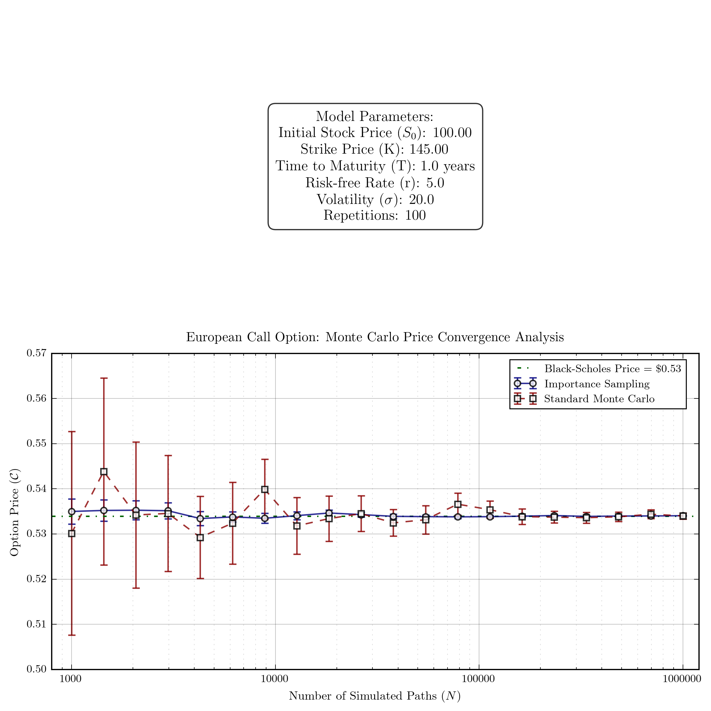

# Importance Sampling for European Call Option Pricing

The objective of this program is to efficiently estimate the price of a European call option via Monte Carlo simulation while reducing estimator variance through an asymptotically optimal importance sampling technique. This approach leverages a change-of-drift strategy inspired by Glasserman, Heidelberger, and Shahabuddin (1999) to direct simulation effort toward the most “important” region of the state space.

## Usage

Clone the repository and run the program as follows:

```sh
$ git clone git@github.com:mlian031/importance-sampling.git
$ cd importance-sampling
$ git checkout reimpl-eq-2.8
$ python -m venv venv && source venv/bin/activate
$ pip install -r requirements.txt
$ python main.py
```

## Background

### Importance Sampling in Monte Carlo Simulation

Monte Carlo methods are widely used in financial engineering to compute option prices. However, when the event of interest (e.g., an option expiring in the money) is rare, standard simulation techniques may suffer from high variance. Importance sampling reduces this variance by drawing samples from an alternative density that places greater weight on regions with significant contributions to the payoff. Specifically, if the objective is to compute

$$
\alpha = \mathbb{E}[h(X)] = \int h(x) f(x) \, dx,
$$

one may instead sample from a density $ g$ (with $ f(x) > 0 \implies g(x) > 0 $) and write

$$
\alpha = \int h(x) \frac{f(x)}{g(x)} g(x) \, dx = \tilde{\mathbb{E}}\left[h(X)\frac{f(X)}{g(X)}\right],
$$

where the likelihood ratio $ f(x)/g(x)$ corrects for the change of measure.

### Asymptotically Optimal Change-of-Drift

Under the risk-neutral measure, the terminal asset price in the geometric Brownian motion model is

$$
S_T = S_0 \exp\left[\left(r-\frac{1}{2}\sigma^2\right)T + \sigma\sqrt{T}\, Z\right],
$$

with $Z \sim \mathcal{N}(0,1)$. Define

$$
A = S_0 \exp\left[\left(r-\frac{1}{2}\sigma^2\right)T\right].
$$

For a European call option with strike \( K \), the payoff is nonzero only when

$$
S_T > K \quad \Longleftrightarrow \quad Z > z_{\min} = \frac{\ln(K/A)}{\sigma\sqrt{T}}.
$$

Following Glasserman et al. (1999), one seeks a drift adjustment that maximizes the function

$$
f(z) = \ln\Bigl(Ae^{\sigma\sqrt{T}\, z} - K\Bigr) - \frac{1}{2}z^2, \quad z \ge z_{\min},
$$

which is equivalent to a reformulation of Equation (2.8). Maximizing $f(z)$ determines the optimal drift shift $\mu_{\text{opt}}$ for the importance sampling distribution.

## Implementation Details

### Use of `minimize_scalar`

The optimization problem for finding the optimal drift shift is one-dimensional. Instead of directly maximizing $f(z)$, we minimize the negative, $-f(z)$, over the interval $[z_{\min}, z_{\min}+10]$. This interval is chosen to capture the region where the optimum is likely to lie. We employ SciPy’s `minimize_scalar` routine with a bounded method because we are optimizing for a one-dimensional problem.

### Simulation Methodology

The program conducts two parallel Monte Carlo experiments:

1. **Standard Monte Carlo:**  
   Simulate $Z \sim \mathcal{N}(0,1)$ to compute the terminal asset price

   $$
   S_T = S_0 \exp\Bigl[(r-\frac{1}{2}\sigma^2)T + \sigma\sqrt{T}\, Z\Bigr]
   $$

   then discount the call payoff $\max(S_T-K,0)$.

2. **Importance Sampling:**  
   Shift the simulated standard normal variates by $\mu_{\text{opt}}$ (i.e., use $Z+\mu_{\text{opt}}$), and adjust the payoff with the likelihood ratio

   $$
   \exp\Bigl(-\mu_{\text{opt}} Z - \frac{1}{2}\mu_{\text{opt}}^2\Bigr)
   $$
   
   This change concentrates simulation effort on the region where the option payoff is significant.

For each method, multiple repetitions are performed for various numbers of simulation paths. The results are then compared in terms of the estimated price, 95% confidence intervals, and variance reduction achieved by the importance sampling technique.

## Sample Results

For instance, using the parameters:

- $S_0 = 100$
- $K = 145$
- $r = 0.05$
- $\sigma = 0.2$
- $T = 1.0$

a typical output is:

```
Number of paths: 10000
Number of paths: 695192
  Standard MC Price: 0.5344 ± 0.0010 (95% CI), Variance: 0.00002428
  Importance Sampling Price: 0.5340 ± 0.0001 (95% CI), Variance: 0.00000033
  Variance Reduction Ratio (MC/IS): 74.53

Number of paths: 1000000
  Standard MC Price: 0.5340 ± 0.0007 (95% CI), Variance: 0.00001189
  Importance Sampling Price: 0.5340 ± 0.0001 (95% CI), Variance: 0.00000024
  Variance Reduction Ratio (MC/IS): 49.81
```



This clearly demonstrates a significant reduction in variance using the importance sampling approach.

## Citations

- Glasserman, P., Heidelberger, P., & Shahabuddin, P. (1999). Asymptotically Optimal Importance Sampling and Stratification for Pricing Path-Dependent Options. *Mathematical Finance, 9*(2), 117–152. [https://doi.org/10.1111/1467-9965.00065](https://doi.org/10.1111/1467-9965.00065)
- Glasserman, P. (2003). *Monte Carlo Methods in Financial Engineering*. New York, NY: Springer.
