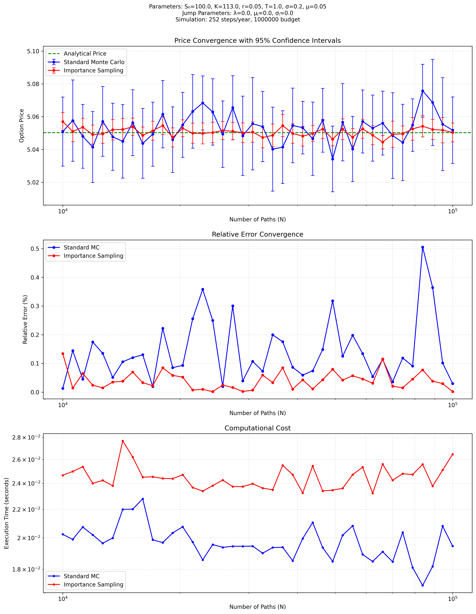

# Importance Sampling

The goal of this program is to optimize the drift parameter of the geometric brownian motion for out-the-money options. The model of the underlying asset movement accounts for both continuous diffusion and discrete jumps in asset prices; however, the jump related parameters are set to zero in this program.

## Usage

```sh
$ git clone git@github.com:mlian031/importance-sampling.git
$ cd importance-sampling
$ python -m venv venv && source venv/bin/activate
$ pip install -r requirements.txt
$ python main.py
```

## Background

### Importance sampling

In Monte Carlo simulation, importance sampling is a variance reduction technique based on changing the probability measure. The core idea is:
Given expectation $E[h(X)]$ where $X$ has density $f$, we can rewrite:

$$
\alpha = E[h(X)] = \int h(x)f(x)dx
$$

For any other density $g$ satisfying $f(x) > 0 \Rightarrow g(x) > 0$, we can represent this as:

$$
\alpha = \int h(x)\frac{f(x)}{g(x)}g(x)dx = \tilde{E}\left[h(X)\frac{f(X)}{g(X)}\right]
$$

where $\tilde{E}$ indicates expectation under $g$. This leads to the importance sampling estimator:

```math
\hat{\alpha}_g = \hat{\alpha}_g(n) = \frac{1}{n}\sum_{i=1}^n h(X_i)\frac{f(X_i)}{g(X_i)}
```

with $X_1,\ldots,X_n$ drawn from $g$. The ratio $f(X_i)/g(X_i)$ is called the likelihood ratio or Radon-Nikodym derivative.

> From Glasserman, Monte Carlo Methods in Financial Engineering

### A jump diffusion model

The Merton Jump Diffusion model extends geometric Brownian motion by adding a compound Poisson process to model sudden price jumps. The stochastic differential equation is:

$$
\frac{dS(t)}{S(t)} = \mu dt + \sigma dW(t) + dJ(t)
$$

where:

- $S(t)$ is the asset price at time $t$
- $\mu$ is the drift
- $\sigma$ is the volatility
- $W(t)$ is a standard Brownian motion
- $J(t)$ is a compound Poisson process given by:

$$
J(t) = \sum_{j=1}^{N(t)} (Y_j - 1)
$$

Here $N(t)$ is a Poisson process with intensity $\lambda$ and $Y_j$ are independent jump sizes, typically lognormally distributed:

$$
\log(Y_j) \sim N(a, b^2)
$$

The solution to the SDE is:

$$
S(t) = S(0)e^{(\mu-\frac{1}{2}\sigma^2)t+\sigma W(t)}\prod_{j=1}^{N(t)} Y_j
$$

For option pricing under the risk-neutral measure, the drift is adjusted to:

$$
\mu = r - \lambda m
$$

where $r$ is the risk-free rate and $m = E[Y_j - 1]$ compensates for the jumps.

> From Glasserman, Monte Carlo Methods in Financial Engineering

## Importance sampling implementation

The optimal $\lambda$ is determined by maximizing the variance reduction ratio, defined as:  

$$
\text{Variance Reduction} = \left(\frac{\text{Standard MC Standard Error}}{\text{IS Standard Error}}\right)^2
$$

This is achieved by minimizing the negative of this ratio:

$$
\text{Objective Function: } -\text{Variance Reduction}
$$

The bounds for $\lambda$ are:  

$$
\lambda_{\text{lower}} = \max(0.001, r - 2\sigma), \quad \lambda_{\text{upper}} = r + 2\sigma
$$

These bounds are centered around the risk-free rate $r$, corresponding to the mean $\mu$ under the risk-neutral measure, adjusted by $\pm 2\sigma$, encompassing approximately 95% of the distribution in a normal context.

To enhance the likelihood of finding the global optimum, the algorithm tests multiple initial values for $\lambda$ within these bounds. 

The optimization uses `scipy.optimize.minimize` with the `L-BFGS-B` method. This algorithm iteratively computes the gradient of the objective function and updates $\lambda$ (distinct from the Poisson intensity parameter $\lambda_j$) using an approximate Hessian. The process continues until the change in the objective function or the gradient norm is below the default tolerance.

In essence, the algorithm identifies the optimal drift adjustment by:
1. Simulating with an initial $\lambda$.
2. Optimizing $\lambda$ to maximize variance reduction.
3. Iteratively refining the simulation and selecting the $\lambda$ with the highest variance reduction ratio across multiple initial points.


## Sample simulations

The average variance reduction for this particular simulation is: 

$$
\frac{\text{Mean Var MC}}{\text{Mean Var IS}} = 13.306
$$



## Citations

P. Glasserman, Monte Carlo Methods in Financial Engineering, vol. 53. New York, NY: Springer New York, 2003. doi: 10.1007/978-0-387-21617-1.
