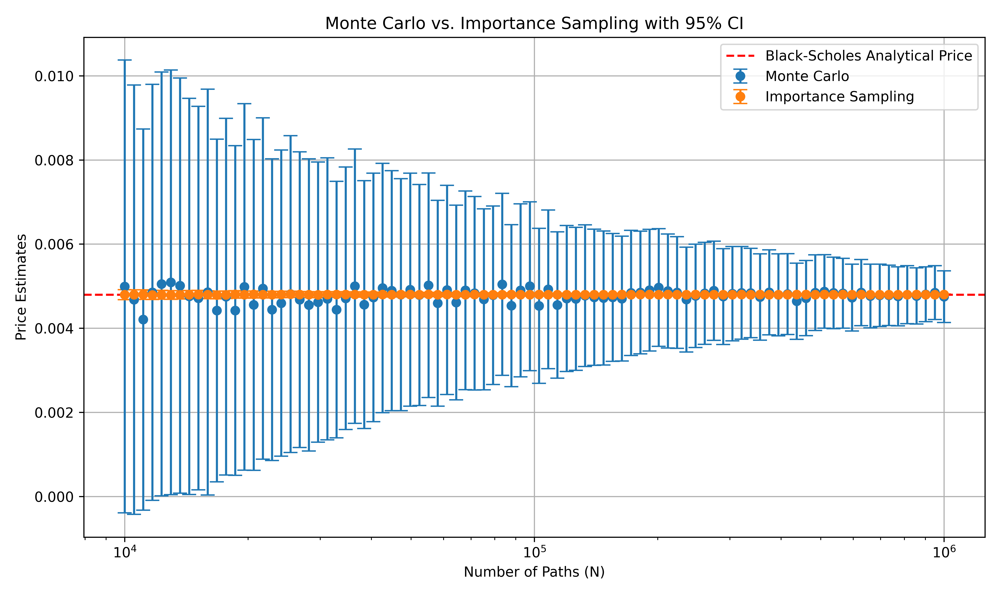

# Importance Sampling

The goal of this program is to optimize the drift parameter of the geometric brownian motion for out-the-money options. The model of the underlying asset movement accounts for both continuous diffusion and discrete jumps in asset prices; however, the jump related parameters are set to zero in this program.

## Usage

```sh
$ git clone git@github.com:mlian031/importance-sampling.git
$ cd importance-sampling
$ git checkout eq-2.8-impl
$ python -m venv venv && source venv/bin/activate
$ pip install -r requirements.txt
$ python main.py
```

## Background

### Importance sampling

In Monte Carlo simulation, importance sampling is a variance reduction technique based on changing the probability measure. The core idea is:
Given expectation $E[h(X)]$ where $X$ has density $f$, we can rewrite:

$$
\alpha = E[h(X)] = \int h(x)f(x)dx
$$

For any other density $g$ satisfying $f(x) > 0 \Rightarrow g(x) > 0$, we can represent this as:

$$
\alpha = \int h(x)\frac{f(x)}{g(x)}g(x)dx = \tilde{E}\left[h(X)\frac{f(X)}{g(X)}\right]
$$

where $\tilde{E}$ indicates expectation under $g$. This leads to the importance sampling estimator:

```math
\hat{\alpha}_g = \hat{\alpha}_g(n) = \frac{1}{n}\sum_{i=1}^n h(X_i)\frac{f(X_i)}{g(X_i)}
```

with $X_1,\ldots,X_n$ drawn from $g$. The ratio $f(X_i)/g(X_i)$ is called the likelihood ratio or Radon-Nikodym derivative.

> From Glasserman, Monte Carlo Methods in Financial Engineering

### A jump diffusion model

The Merton Jump Diffusion model extends geometric Brownian motion by adding a compound Poisson process to model sudden price jumps. The stochastic differential equation is:

$$
\frac{dS(t)}{S(t)} = \mu dt + \sigma dW(t) + dJ(t)
$$

where:

- $S(t)$ is the asset price at time $t$
- $\mu$ is the drift
- $\sigma$ is the volatility
- $W(t)$ is a standard Brownian motion
- $J(t)$ is a compound Poisson process given by:

$$
J(t) = \sum_{j=1}^{N(t)} (Y_j - 1)
$$

Here $N(t)$ is a Poisson process with intensity $\lambda$ and $Y_j$ are independent jump sizes, typically lognormally distributed:

$$
\log(Y_j) \sim N(a, b^2)
$$

The solution to the SDE is:

$$
S(t) = S(0)e^{(\mu-\frac{1}{2}\sigma^2)t+\sigma W(t)}\prod_{j=1}^{N(t)} Y_j
$$

For option pricing under the risk-neutral measure, the drift is adjusted to:

$$
\mu = r - \lambda m
$$

where $r$ is the risk-free rate and $m = E[Y_j - 1]$ compensates for the jumps.

> From Glasserman, Monte Carlo Methods in Financial Engineering

## Implementation

The program uses importance sampling to estimate the price of an out-the-money call option. The payoff function is:

$$
G(Z) = \max(S_T - K, 0)
$$

and the logarithmic transformation $F(Z)$ is: 

$$F(Z) = log(G(Z))$$ 

Since $G(Z) = 0$ whenever $S_T < K$, the logathrim is undefined in these cases. Consequently, $F(Z)$ is defined as a piecewise function:

$$
F(Z) = \begin{cases}
    log(S_T - K) & \text{if } S_T \geq K \\
    -\infty & \text{otherwise}
\end{cases}
$$

To avoid computational issues when $G(Z) = 0$, the program substitutes a small stabilization value ($10^{-6}$) in these cases.

The optimization problem follows Equation (2.8) from Glasserman and Heidelberger (2000), where the goal is to maximize:

$$
\max_{z \in D} \left\lbrace F(Z) - \frac{1}{2}z'z \right\rbrace
$$

Here, $z \in D$ represents the feasible set for the control variates or drift adjustment in the importance sampling distribution.

> From Glasserman, Asymptotically Optimal Importance Sampling and Stratified Sampling for Pricing Path-Dependent Options

## Notes on the implementation

### 1
Bounds for the optimization problem are set to $[-10^3, 10^3]$ for the drift parameter. The program encounters numerical issues when the lower bound is set lower than $-10^3$. I am not sure why this happens.

### 2 
There is a previous implementation using a fixed point method of iteratively searching for the optimal drift parameter. 

We begin with (2.5) from Glasserman and Heidelberger (2000):

$$
\min_{\mu} \, \mathbb{E} \left[ G(Z)^2 e^{-\mu' Z + (1/2) \mu' \mu} \mathbb{1}_D \right]
$$

Let 

$$
f(\mu) = \mathbb{E} \left[ G(Z)^2 e^{-\mu' Z + (1/2) \mu' \mu} \mathbb{1}_D \right] = \int_D G(z)^2 \, e^{-\mu z + \tfrac12\,\mu^2} \, p(z)\,\mathrm{d}z
$$

Where $p(z)$ is the probability density function of Z and the indicator function returns 0 outside of $D$ so that integration only occurs on $D$. $D$ is the domain on which $Z$ (and hence $z$) takes values. 

We want $\frac{d}{d\mu} f(\mu)$.

$$
\frac{d}{d\mu} f(\mu) = \frac{d}{d\mu} \int_D G(z)^2 \, e^{-\mu z + \tfrac12\,\mu^2} \, p(z)\,\mathrm{d}z = \int_D G(z)^2 \, \frac{d}{d\mu}\left[e^{-\mu z + \tfrac12\,\mu^2}\right]\,\mathrm{d}z
$$

Now we differentiate:

$$
\frac{d}{d\mu} \, e^{-\mu z + \tfrac12\,\mu^2} = e^{-\mu z + \tfrac12\,\mu^2} \, \frac{d}{d\mu} \, \left[ -\mu z + \frac{1}{2} \mu^2 \right] \\
= e^{-\mu z + \tfrac12\,\mu^2} \, (-z + \mu)
$$

Putting this back into the integral, 

$$
\frac{d}{d\mu}f(\mu) = \int_D G(z)^2 \, {p}(z) \,\left[ e^{-\mu z + \tfrac12\,\mu^2}\, (-Z + \mu) \, \right] \mathrm{d}z
$$

$$
\frac{d}{d\mu}f(\mu) = \mathbb{E}\left[ G(z)^2 \, e^{-\mu z + \tfrac12\,\mu^2}\, (-Z + \mu) \, \mathbb{1}_D \right]
$$

To find the $\mu$ that minimizes $f(\mu)$, we set the derivative equal to zero:

$$
\mathbb{E}\left[ G(z)^2 \, e^{-\mu z + \tfrac12\,\mu^2}\, (-Z + \mu) \, \mathbb{1}_D \right] = 0
$$


Define $w(Z,\mu) = G(Z)^2 e^{-\mu Z + \tfrac12 \mu^2} \mathbb{1}_D$

$$
\mathbb{E}\left[ w(Z,\mu)(-Z+\mu) \right] = 0 \\
$$
$$
\mathbb{E}\left[-Z w(Z,\mu) \right] + \mu\mathbb{E}\left[w(Z, \mu) \right] = 0 \\
$$
$$
-\mathbb{E}\left[Z w(Z, \mu)\right] + \mu\mathbb{E}\left[w(Z, \mu) \right] = 0 \\
$$
$$
\mu\mathbb{E}\left[w(Z, \mu) \right] = \mathbb{E}\left[Z w(Z, \mu)\right] \\
$$
$$
\mu = \frac{\mathbb{E}\left[Zw(Z, \mu)\right]}{\mathbb{E}\left[w(Z, \mu) \right]}
$$

Expressing it in terms of the definition of expected value,

$$
\mu = \frac{\sum_{i=1}^N\,Z_i\,G(Z_i)^2\,e^{-\mu\,Z_i + \tfrac12\mu^2}}{\sum_{i=1}^N\,G(Z_i)^2\,e^{-\mu\,Z_i + \tfrac12\mu^2}}
$$

This becomes our fixed-point equation.

Then we pick an initial guess $\mu^{(0)}$ and plug $\mu^{(0)}$ into the right-hand side to get $\mu^{(1)}$ and repeat until $| \mu^{k+1} - \mu^{k} | < 10^{-6}$ or the $\verb|numpy|$ tolerance value.

**Remark:** There is no significant difference in speed or accuracy between solving 2.8 or solving 2.5 using the fixed-point method. I will upload benchmarks soon.

# Sample

Parameters:
- $S_0 = 100$
- $K = 200$
- $r = 0.05$
- $\sigma = 0.2$
- $T = 1.0$

This is the result of a deep out-the-money option with $K = 200$ and $S_0 = 100$.




```
Path Count | MC Estimate | MC StdErr | IS Estimate | IS StdErr
    10000 |    0.004992 |   0.002746 |    0.004798 |   0.000060
    10531 |    0.004677 |   0.002603 |    0.004799 |   0.000059
    11090 |    0.004206 |   0.002311 |    0.004800 |   0.000057
    11679 |    0.004854 |   0.002523 |    0.004791 |   0.000056
    12299 |    0.005052 |   0.002570 |    0.004795 |   0.000054
    12952 |    0.005090 |   0.002576 |    0.004790 |   0.000053
    13640 |    0.005011 |   0.002518 |    0.004793 |   0.000051
    14364 |    0.004757 |   0.002402 |    0.004796 |   0.000050
    15127 |    0.004715 |   0.002326 |    0.004803 |   0.000049
    15931 |    0.004858 |   0.002461 |    0.004797 |   0.000048
    16777 |    0.004421 |   0.002077 |    0.004790 |   0.000046
    17668 |    0.004750 |   0.002163 |    0.004794 |   0.000045
    18606 |    0.004420 |   0.001999 |    0.004804 |   0.000044
    19594 |    0.004983 |   0.002222 |    0.004799 |   0.000043
    20635 |    0.004554 |   0.002006 |    0.004803 |   0.000042
    21730 |    0.004943 |   0.002069 |    0.004799 |   0.000041
    22884 |    0.004440 |   0.001829 |    0.004798 |   0.000040
    24100 |    0.004597 |   0.001856 |    0.004801 |   0.000039
    25380 |    0.004812 |   0.001921 |    0.004808 |   0.000038
    26727 |    0.004678 |   0.001793 |    0.004801 |   0.000037
    28147 |    0.004553 |   0.001772 |    0.004798 |   0.000036
    29642 |    0.004619 |   0.001699 |    0.004793 |   0.000035
    31216 |    0.004698 |   0.001711 |    0.004802 |   0.000034
    32874 |    0.004442 |   0.001555 |    0.004802 |   0.000033
    34619 |    0.004712 |   0.001592 |    0.004802 |   0.000032
    36458 |    0.005000 |   0.001663 |    0.004801 |   0.000031
    38394 |    0.004561 |   0.001503 |    0.004799 |   0.000031
    40433 |    0.004731 |   0.001507 |    0.004797 |   0.000030
    42580 |    0.004956 |   0.001512 |    0.004799 |   0.000029
    44842 |    0.004893 |   0.001456 |    0.004796 |   0.000028
    47223 |    0.004798 |   0.001407 |    0.004802 |   0.000028
    49731 |    0.004916 |   0.001412 |    0.004800 |   0.000027
    52372 |    0.004789 |   0.001339 |    0.004799 |   0.000026
    55153 |    0.005019 |   0.001361 |    0.004803 |   0.000026
    58082 |    0.004593 |   0.001249 |    0.004798 |   0.000025
    61166 |    0.004909 |   0.001268 |    0.004801 |   0.000024
    64415 |    0.004610 |   0.001181 |    0.004796 |   0.000024
    67836 |    0.004899 |   0.001205 |    0.004796 |   0.000023
    71438 |    0.004831 |   0.001174 |    0.004802 |   0.000022
    75232 |    0.004687 |   0.001097 |    0.004796 |   0.000022
    79227 |    0.004784 |   0.001082 |    0.004799 |   0.000021
    83435 |    0.005044 |   0.001103 |    0.004797 |   0.000021
    87865 |    0.004535 |   0.000982 |    0.004801 |   0.000020
    92532 |    0.004900 |   0.001050 |    0.004798 |   0.000020
    97446 |    0.004998 |   0.001024 |    0.004799 |   0.000019
   102620 |    0.004532 |   0.000939 |    0.004802 |   0.000019
   108070 |    0.004923 |   0.000962 |    0.004798 |   0.000018
   113809 |    0.004552 |   0.000888 |    0.004799 |   0.000018
   119853 |    0.004706 |   0.000885 |    0.004796 |   0.000017
   126218 |    0.004697 |   0.000867 |    0.004797 |   0.000017
   132921 |    0.004772 |   0.000859 |    0.004798 |   0.000016
   139980 |    0.004736 |   0.000825 |    0.004797 |   0.000016
   147414 |    0.004717 |   0.000813 |    0.004797 |   0.000016
   155242 |    0.004732 |   0.000775 |    0.004799 |   0.000015
   163486 |    0.004704 |   0.000757 |    0.004800 |   0.000015
   172169 |    0.004840 |   0.000759 |    0.004798 |   0.000014
   181312 |    0.004848 |   0.000743 |    0.004800 |   0.000014
   190940 |    0.004904 |   0.000737 |    0.004800 |   0.000014
   201080 |    0.004968 |   0.000714 |    0.004799 |   0.000013
   211759 |    0.004885 |   0.000691 |    0.004799 |   0.000013
   223005 |    0.004848 |   0.000677 |    0.004796 |   0.000013
   234847 |    0.004682 |   0.000636 |    0.004798 |   0.000012
   247319 |    0.004771 |   0.000627 |    0.004799 |   0.000012
   260453 |    0.004830 |   0.000619 |    0.004798 |   0.000012
   274285 |    0.004891 |   0.000601 |    0.004798 |   0.000011
   288851 |    0.004752 |   0.000581 |    0.004798 |   0.000011
   304190 |    0.004821 |   0.000572 |    0.004798 |   0.000011
   320345 |    0.004841 |   0.000561 |    0.004800 |   0.000011
   337357 |    0.004836 |   0.000542 |    0.004799 |   0.000010
   355272 |    0.004742 |   0.000524 |    0.004800 |   0.000010
   374139 |    0.004853 |   0.000516 |    0.004799 |   0.000010
   394008 |    0.004792 |   0.000497 |    0.004799 |   0.000010
   414932 |    0.004811 |   0.000489 |    0.004797 |   0.000009
   436967 |    0.004641 |   0.000462 |    0.004800 |   0.000009
   460173 |    0.004715 |   0.000456 |    0.004800 |   0.000009
   484610 |    0.004843 |   0.000459 |    0.004799 |   0.000009
   510346 |    0.004873 |   0.000446 |    0.004800 |   0.000008
   537448 |    0.004839 |   0.000433 |    0.004798 |   0.000008
   565990 |    0.004830 |   0.000423 |    0.004800 |   0.000008
   596047 |    0.004726 |   0.000405 |    0.004798 |   0.000008
   627700 |    0.004847 |   0.000401 |    0.004799 |   0.000008
   661035 |    0.004767 |   0.000386 |    0.004799 |   0.000007
   696140 |    0.004780 |   0.000378 |    0.004799 |   0.000007
   733108 |    0.004780 |   0.000366 |    0.004798 |   0.000007
   772041 |    0.004756 |   0.000358 |    0.004799 |   0.000007
   813040 |    0.004796 |   0.000352 |    0.004799 |   0.000007
   856217 |    0.004767 |   0.000340 |    0.004799 |   0.000006
   901687 |    0.004805 |   0.000332 |    0.004799 |   0.000006
   949572 |    0.004846 |   0.000326 |    0.004798 |   0.000006
  1000000 |    0.004749 |   0.000313 |    0.004800 |   0.000006

Variance Reduction Multiple: 2455.37
```

## Citations

P. Glasserman, Monte Carlo Methods in Financial Engineering, vol. 53. New York, NY: Springer New York, 2003. doi: 10.1007/978-0-387-21617-1.

Glasserman, P., Heidelberger, P. and Shahabuddin, P. (1999), Asymptotically Optimal Importance Sampling and Stratification for Pricing Path-Dependent Options. Mathematical Finance, 9: 117-152. https://doi.org/10.1111/1467-9965.00065
